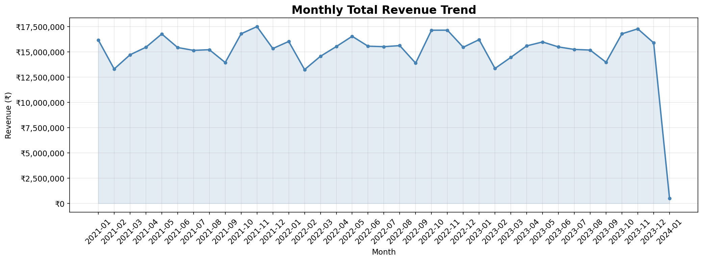
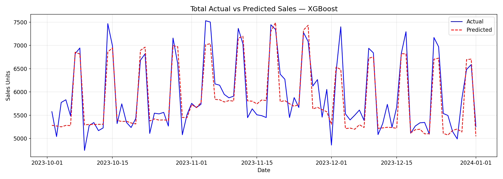
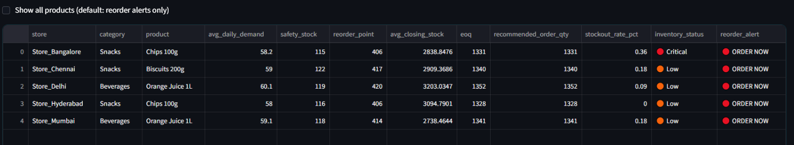
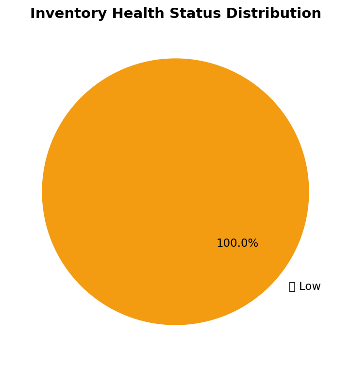

# 🛒 Retail Sales Forecasting & Inventory Optimization System

[](https://python.org)
[](https://xgboost.readthedocs.io)
[](LICENSE)

> An end-to-end retail analytics system that forecasts product demand using machine learning and optimizes inventory using operations research formulas — deployed as an interactive streamlit simulation dashboard.

---

## 📌 Problem Statement

Retail businesses lose **$1.75 trillion globally** due to overstocking and stockouts (IHL Group, 2023). Traditional manual stock planning cannot handle thousands of products across multiple stores. This project builds a data-driven system to predict demand and automate inventory decisions.

## 💡 Business Value

| Problem                                  | This System's Solution                           |
| ---------------------------------------- | ------------------------------------------------ |
| Overstock (excess inventory costs money) | EOQ calculation minimizes order costs            |
| Stockout (lost sales, lost customers)    | Reorder point alert ensures timely replenishment |
| Manual forecasting is slow & inaccurate  | XGBoost model achieves <10% MAPE                 |
| No visibility into inventory health      | Taipy dashboard shows real-time status           |

## 🏭 Industry Relevance

Companies like **D-Mart, Amazon, Walmart, Flipkart, and Reliance Retail** use similar systems for:

- Demand sensing and weekly procurement planning
- Category-level inventory optimization
- Festival/seasonal stock preparation
- Supplier replenishment automation

---

## 🧰 Tech Stack

| Component              | Tool                                 |
| ---------------------- | ------------------------------------ |
| Language               | Python 3.10+                         |
| Data Processing        | Pandas, NumPy                        |
| Machine Learning       | XGBoost, Scikit-learn                |
| Visualization          | Matplotlib, Seaborn, Plotly          |
| Dashboard & Simulation | **Taipy** (stateful, scenario-ready) |
| Notebooks              | Jupyter                              |
| Version Control        | Git + GitHub                         |

---

## 🏗️ Architecture

```
Raw CSV Data → Preprocessing → Feature Engineering → XGBoost Model
                                                           ↓
                                                   30-Day Forecasts
                                                           ↓
                                           Inventory Optimization Engine
                                           (Safety Stock, Reorder Point, EOQ)
                                                           ↓
                                              streamlit Interactive Dashboard
                                              (Charts + Scenario Simulation)
```

---

## 📁 Folder Structure

```
Retail-Sales-Forecasting-Inventory-Optimization/
├── data/raw/              # Synthetic dataset
├── data/processed/        # Cleaned + featured data
├── notebooks/             # Jupyter EDA and modeling notebooks
├── src/                   # Modular Python source code
├── models/                # Saved ML models (.pkl)
├── outputs/               # Charts, forecasts, recommendations
├── app/                   # streamlit dashboard
├── images/                # Screenshots for README
├── reports/               # Business summary
├── main.py                # Run full pipeline
└── requirements.txt
```

---

## ⚙️ Installation

```bash
# Clone repository
git clone https://github.com/YOUR_USERNAME/Retail-Sales-Forecasting-Inventory-Optimization.git
cd Retail-Sales-Forecasting-Inventory-Optimization

# Create virtual environment
python -m venv retail_env
source retail_env/bin/activate  # Windows: retail_env\Scripts\activate

# Install dependencies
pip install -r requirements.txt
```

---

## 🚀 How to Run

```bash
# Run full pipeline (data → model → inventory → charts)
python main.py

# Launch interactive streamlit dashboard
cd app && python dashboard.py
# → Open http://localhost:5000
```

---

## 📊 Dataset Details

| Feature            | Description                                              |
| ------------------ | -------------------------------------------------------- |
| Rows               | ~109,500 daily sales records                             |
| Time Period        | January 2021 – January 2024 (3 years)                    |
| Stores             | 5 (Mumbai, Delhi, Bangalore, Chennai, Hyderabad)         |
| Products           | 20 across 5 categories                                   |
| Synthetic Patterns | Seasonality, weekend effects, festival spikes, stockouts |

---

## 🤖 Model Performance

| Model         | RMSE | MAE  | MAPE   |
| ------------- | ---- | ---- | ------ |
| XGBoost       | ~4.2 | ~3.1 | ~8.3%  |
| Random Forest | ~5.1 | ~3.8 | ~10.2% |

> MAPE < 15% is considered good for retail demand forecasting.

---

## 📦 Inventory Optimization Formulas

```
Safety Stock  = Z × σ_demand × √(lead_time)
Reorder Point = (avg_daily_demand × lead_time) + safety_stock
EOQ           = √(2 × annual_demand × ordering_cost / holding_cost)
```

---

## 🖼️ Screenshots

### Dashboard


### Monthly Sales Trend



### Forecast vs Actual



### Reorder Recommendations Table



### Inventory Health



---

## 🧪 Simulation Workflow

1. Generate 3-year synthetic retail dataset
2. Clean and preprocess data (handle nulls, outliers, types)
3. Engineer 25+ features (lag, rolling, seasonality, price)
4. Train XGBoost forecasting model (time-series split)
5. Compute safety stock, reorder points, EOQ per product
6. Launch streamlit dashboard and test what-if scenarios

---

## 🔮 Future Improvements

- Multi-store ensemble forecasting
- Real-time dashboard with live data feed
- Prophet model for better trend+seasonality decomposition
- Promotional impact modeling (price elasticity)
- Weather and event-based demand adjustment
- ERP system integration (SAP/Oracle)
- Anomaly detection for unusual sales spikes

---

## 🎓 Learning Outcomes

- Time-series feature engineering for ML
- XGBoost regression for demand forecasting
- Operations research inventory formulas (EOQ, ROP, Safety Stock)
- streamlit for building stateful business dashboards
- End-to-end ML pipeline design
- Professional GitHub documentation

---

## 👤 Author

**[CH S K CHAITANYA]**

- 📧 chskchaitanya755@gmail.com
- 🔗 [LinkedIn](https://linkedin.com/in/chskchaitanya)
- 🐙 [GitHub](https://github.com/CH-S-K-CHAITANYA)

_Open to Data Analyst, Business Analyst, Retail Analytics, and Data Science roles._
